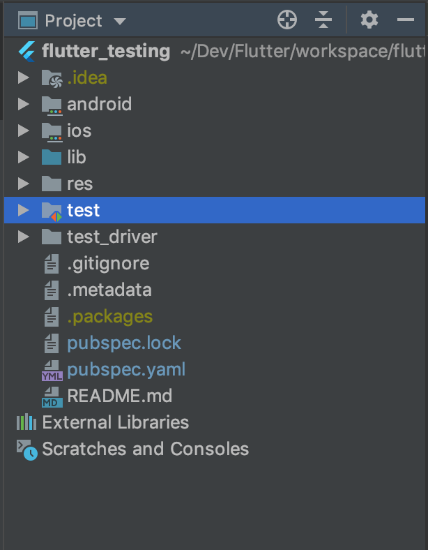

# 1. Flutter 单元测试

[官方文档](https://flutter.dev/docs/testing)

当 App 中的功能越来越多的时候，我们想要去手动测试一个功能的时候，会变的非常麻烦，这个时候就需要单元测试来帮助我们测试想要测的功能。

Flutter 中提供了三种测试：

- unit test ： 单元测试
- widget test ： Widget 测试
- integration test ： 集成测试

当创建一个新的 Flutter 工程之后，工程目录下就会有一个 test 目录，该目录用来存放测试文件：


## 1.1. 单元测试基本知识

单元测试用来验证代码中的某一个方法或者某一块逻辑是否正确。

写单元测试的步骤如下：

1. 添加 test 或者 flutter_test 依赖到工程中
1. 在 test 目录下创建一个测试文件，如： counter_test.dart
1. 创建一个待测试的文件，如： counter.dart
1. 在 counter_test.dart 文件中编写 test
1. 如果有多个测试的需要在一起测试的情况下，可以使用 group
1. 运行测试类

### 1.1.1. 添加依赖

在工程的 pubspec.yaml 中添加 flutter_test 的依赖：

```yaml
dev_dependencies:
  flutter_test:
    sdk: flutter
```

### 1.1.2. 创建测试文件

这里，需要创建两个文件，一个是测试类文件 counter_test.dart 还有一个是被测试文件counter.dart。当这两个文件创建完之后，目录结构如下：

```
.
├── lib
│   ├── counter.dart
├── test
│   ├── counter_test.dart
```

### 1.1.3. 编写被测试类

Counter 类中的方法如下：

```dart
class Counter {
  int value = 0;

  void increment() => value++;

  void decrement() => value--;
}
```

### 1.1.4. 编写测试类

在 counter_test.dart 文件中编写单元测试，里面会使用到一些 flutter_test 包提供的顶层方法，如

- `test(...)` 方法是用来定义一个单元测试的，
- `expect(...)` 方法用来验证结果的。

test(...) 方法里面有两个必需的参数，第一个参数表示这个单元测试的描述信息，第二个是一个 Function，用来编写测试内容的。

expect(...) 方法中也有两个必需的参数，第一个是需要验证的变量，第二个是与该变量匹配的值。

`counter_test.dart` 中的代码如下：

```dart
import 'package:flutter_test/flutter_test.dart';
import 'package:flutter_testing/counter.dart';

/// 也可以使用命令来运行 flutter test test/counter_test.dart

void main() {
  // 单一的测试
  test("测试 value 递增", () {
    final counter = Counter();
    counter.increment();
    
    // 验证 counter.value 的是是否为 1
    expect(counter.value, 1);
  });
```

### 1.1.5. 使用 group 来执行多个测试

```dart
import 'package:flutter_test/flutter_test.dart';
import 'package:flutter_testing/counter.dart';

void main() {
  // 使用 group 合并多个测试。用来测试多个有关联的测试
  group("Counter", () {
    // test-1
    test("value should start at 0", () {
      expect(Counter().value, 0);
    });
    
    // test-2
    test("value should be increment", () {
      final counter = Counter();
      counter.increment();
      expect(counter.value, 1);
    });
    
    // test-3
    test("value should be decremented", () {
      final counter = Counter();
      counter.decrement();
      expect(counter.value, -1);
    });
  });
}
```

### 1.1.6. 执行单元测试

如果使用的是 Android Studio 或者 Idea 开发的话，那么直接点击侧边的运行按钮来执行或者调试：

如果使用的是 VSCode ，则可以使用命令来执行测试：

```dart
flutter test test/counter_test.dart
```

## 1.2. 模拟数据

使用 Mockito 来模拟对象依赖

首先，添加 mockito 的依赖到 pubspec.yaml 中：

```yaml
dev_dependencies:
  mockito: 4.1.1
```

然后新建一个被测试的类：

```dart
class A {
  int calculate(B b) {
    int randomNum = b.getRandomNum();
    return randomNum * 2;
  }
}

class B {
  int getRandomNum() {
    return Random().nextInt(100);
  }
}
```

上述代码中，类 A 的 calculate 方法是依赖类 B 的。这时测试 calculate 方法的时候可以使用 mockito 来模拟一个类 B

接着新建一个测试类：

```dart
import 'package:flutter_test/flutter_test.dart';
import 'package:flutter_testing/mock_d.dart';
import 'package:mockito/mockito.dart';

/// 使用 mockito 模拟一个类 B
class MockB extends Mock implements B {}

void main() {
  test("测试使用 mockito 来 mock 依赖", () {
    var b = MockB();
    var a = A();
    // 当调用 b.getRandomNum() 方法的时候返回 10
    when(b.getRandomNum()).thenReturn(10);
    expect(a.calculate(b), 20);

    // 检查 b.getRandomNum(); 是否调用过
    verify(b.getRandomNum());
  });
}
```

官方文档上还有一个这样的例子，是使用 mockito 来模拟接口返回的数据，要测试的方法如下：

```dart
Future<Post> fetchPost(http.Client client) async {
  final response =
      await client.get("https://jsonplaceholder.typicode.com/posts/1");
  if (response.statusCode == 200) {
    return Post.fromJson(json.decode(response.body));
  } else {
    throw Exception('Failed to load post');
  }
}
```

上述方法中就是请求一个接口，请求成功则解析返回，否则抛出异常。测试该方法的代码如下：

```dart
import 'package:flutter_test/flutter_test.dart';
import 'package:flutter_testing/post_service.dart';
import 'package:http/http.dart' as http;
import 'package:mockito/mockito.dart';

/// 使用 mock 模拟一个 http.Client 对象
class MockClient extends Mock implements http.Client {}

void main() {
  group("fetchPost", () {
    test("接口返回数据正确", () async {
      final client = MockClient();

      // 当调用指定的接口的时候返回指定的数据
      when(client.get("https://jsonplaceholder.typicode.com/posts/1"))
          .thenAnswer((_) async {
        return http.Response(
            '{"title": "test title", "body": "test body"}', 200);
      });
      var post = await fetchPost(client);
      expect(post.title, "test title");
    });

    test("接口返回数据错误，抛出异常", () {
      final client = MockClient();

      // 当调用这个接口的时候返回 Not Found
      when(client.get("https://jsonplaceholder.typicode.com/posts/1"))
          .thenAnswer((_) async {
        return http.Response('Not Found', 404);
      });
      expect(fetchPost(client), throwsException);
    });
  });
}
```

## 1.3. 单元测试案例

### 例1：通过测试

以下示例定义方法 Add() 。此方法采用两个整数值并返回表示总和的整数。要测试这个 add() 方法 -

1. 导入 test 包，如下所示。
2. 使用 test() 函数定义测试。这里， test() 函数使用 expect() 函数来强制执行断言。

```dart
import 'package:test/test.dart';      
// Import the test package

int Add(int x,int y)                  
// Function to be tested {
   return x+y;
}  
void main() {
   // Define the test
   test("test to check add method",(){  
      // Arrange
      var expected = 30;

      // Act
      var actual = Add(10,20);

      // Asset
      expect(actual,expected);
   });
}
```

它应该产生以下 输出

```
00:00 +0: test to check add method
00:00 +1: All tests passed!
```

### 例2：失败测试

下面定义的 subtract() 方法存在逻辑错误。以下测试 验证相同。

```dart
import 'package:test/test.dart';
int Add(int x,int y){
   return x+y;
}
int Sub(int x,int y){
   return x-y-1;
}  
void main(){
   test('test to check sub',(){
      var expected = 10;   
      // Arrange

      var actual = Sub(30,20);  
      // Act

      expect(actual,expected);  
      // Assert
   });
   test("test to check add method",(){
      var expected = 30;   
      // Arrange

      var actual = Add(10,20);  
      // Act

      expect(actual,expected);  
      // Asset
   });
}
```

输出 - 函数 add() 的测试用例通过，但 subtract() 的测试失败，如下所示。

```dart
00:00 +0: test to check sub
00:00 +0 -1: test to check sub
Expected: <10>
Actual: <9>
package:test  expect
bin\Test123.dart 18:5  main.<fn>

00:00 +0 -1: test to check add method
00:00 +1 -1: Some tests failed.  
Unhandled exception:
Dummy exception to set exit code.
#0  _rootHandleUncaughtError.<anonymous closure> (dart:async/zone.dart:938)
#1  _microtaskLoop (dart:async/schedule_microtask.dart:41)
#2  _startMicrotaskLoop (dart:async/schedule_microtask.dart:50)
#3  _Timer._runTimers (dart:isolate-patch/timer_impl.dart:394)
#4  _Timer._handleMessage (dart:isolate-patch/timer_impl.dart:414)
#5  _RawReceivePortImpl._handleMessage (dart:isolate-patch/isolate_patch.dart:148)
```

### 网络接口测试

同样的，在 test 目录下新建一个文件，如：http_test.dart，
在这个文件中去请求一个接口，然后验证返回的结果：

```dart
import 'package:flutter_test/flutter_test.dart';
import 'package:http/http.dart' as http;

void main() {
  test("测试网络请求", () async {
    // 假如这个请求需要一个 token
    final token = "54321";
    final response = await http.get(
      "https://api.myjson.com/bins/18mjgh",
      headers: {"token": token},
    );
    if (response.statusCode == 200) {
      // 验证请求 header 中的 token
      expect(response.request.headers['token'], token);
      print(response.request.headers['token']);
      print(response.body);

      // 解析返回的 json
      Person person = parsePersonJson(response.body);
      
      // 验证 person 对象不为空
      expect(person, isNotNull);
      // 检测 person 对象中的属性值是否都正确
      expect(person.name, "Lili");
      expect(person.age, 20);
      expect(person.country, 'China');
    }
  });
}
```


作者：刘斯龙
链接：https://juejin.cn/post/6844903955814694920
来源：掘金
著作权归作者所有。商业转载请联系作者获得授权，非商业转载请注明出处。